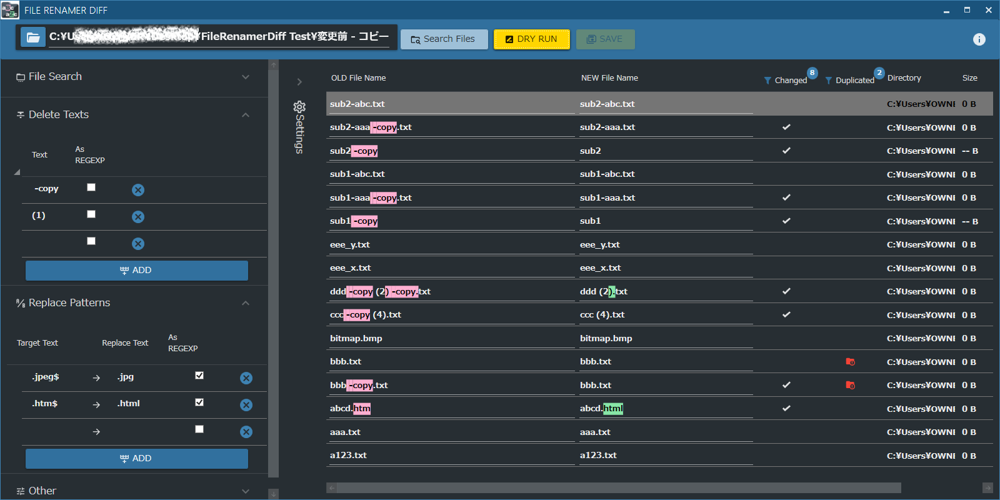

#  File Renamer Diff

A File Renamer App featuring a difference display before and after the change for Windows.

# Screen Shot

# Features

## Difference View

## Detect Duplicate

## Unlimited number of Delete & Replace Patterns

## 5 Language Support

- English 
- Japanese
- Germany (machine translation)
- Russian (machine translation)
- Chinese (machine translation)

## Light / Dark Theme Switching

# Download

### Microsoft Store (Windows 10 only)

### Portable version (Windows 7, 8.1, 10)

Download from [LATEST RELEASE](https://github.com/soi013/filerenamerdiff/releases).

- `FileRenamerDiff_app_win-x64~` is for x64(64bit) OS. 
- `FileRenamerDiff_app_win-x86~` is for x86(32bit) OS.

This application is self-contained.  
This means that you don't need to install .NET Framework or .NET Core.

# How to use
The basic usage is as follows.

1. Target file specification
   You can drag and drop files into the file list or search for <kbd>Search Files</kbd> from a specific directory.
   
1. Set rename pattern
   Set the Delete/Replace pattern from <kbd>Settings</kbd>.

1. Confirm rename
   Execute <kbd>DRY RUN</kbd> to confirm the renaming.

1. Execute rename
   Execute <kbd>SAVE</kbd> to rename the actual file.

   

- [More document -English](./src/FileRenamerDiff/HowToUse/how_to_use.md)
- [More document -Japanese](./src/FileRenamerDiff/HowToUse/how_to_use.ja.md)
- [More document -Germany](./src/FileRenamerDiff/HowToUse/how_to_use.de.md)
- [More document -Russian](./src/FileRenamerDiff/HowToUse/how_to_use.ru.md)
- [More document -Chinese](./src/FileRenamerDiff/HowToUse/how_to_use.zh.md)

# Environment

- Windows 10 Ver 1803+
- Windows 8.1
- Windows 7 SP1+

# 3rd Party Libraries / Icons

Following codes / libraries make it happen, thanks for their work.

[3rd Party Libraries / Icons](./src/FileRenamerDiff/Resources/License.md)
